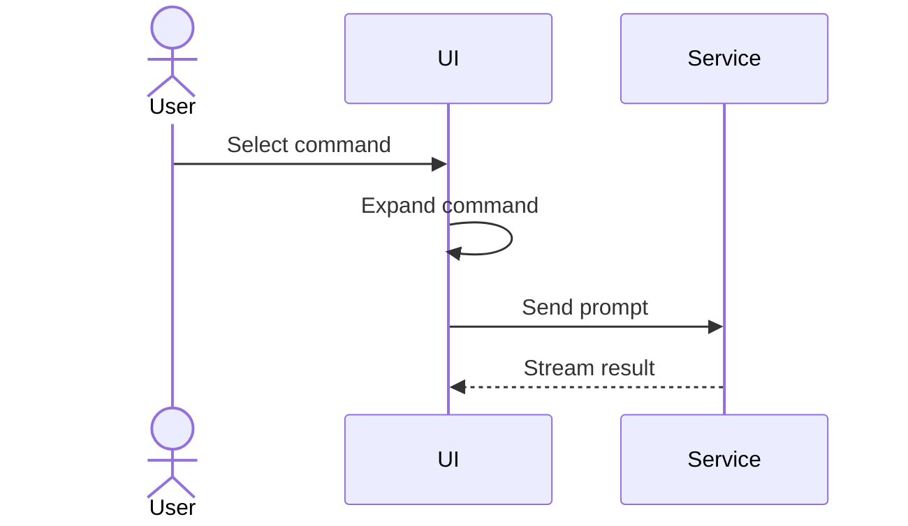

# Explain

Help the user understand, assess, or act on the specified topic. Apply ASD-STE100-inspired principles to the prose. Choose the smallest visual that makes the key relationships clear. This skill is self-contained; it does not require show-me.

## Identify the topic

Use the request and conversation to identify the topic, audience, and purpose. Write for a reader who knows the basic context but is unfamiliar with the topic. Honor the user's requested depth and format.

Use the language explicitly requested by the user. Otherwise, match the language of their current request, not that of quoted material, source code, or these instructions. For mixed-language or language-neutral requests, use the main language of the surrounding conversation. Apply this choice to prose and visual labels while preserving exact identifiers and UI labels.

If the user invokes the skill without a topic and the context provides none, ask what they want explained. Otherwise, explain directly. Clarify only ambiguities that would change the answer; do not require a fixed intake form.

## Write the explanation

1. Answer the main question in one or two sentences. Then add the mechanism, conditions, or examples needed to understand it.
2. Express one main idea per sentence. Prefer active voice and identify who does what to which object. Keep connecting words that make the meaning complete.
3. Use one name for each concept. Explain necessary terms and abbreviations on first use. Preserve the exact spelling of code identifiers, UI labels, and product names.
4. Make references explicit. When several objects are present, repeat the name instead of using an ambiguous pronoun.
5. Put a condition before the action it controls. Use clear if-then statements. Distinguish requirements, recommendations, and permissions, and distinguish all conditions from any condition.
6. Replace abstract phrases with concrete actions. For example, replace “perform a configuration adjustment” with “change the configuration.” Preserve meaningful negations, limits, values, units, and exceptions.
7. Match the structure to the question: definitions and examples for concepts, causes and results for mechanisms, shared dimensions for comparisons, and numbered steps for procedures. Use only structure that helps understanding.
8. Start procedural steps with action verbs and give each step one main action. Place necessary prerequisites or hazard notices before the relevant step. Explain how to confirm key results. Explaining an operation does not authorize its execution.

A short question can need only one paragraph. Expand complex answers as needed; do not remove essential information to meet a fixed sentence or word count. Use analogies as aids and identify where they stop applying.

## Choose the smallest view

Decide whether the reader needs a definition or condition, or needs to see order, relationships, hierarchy, or change. Use prose alone when it is sufficient. When a visual reduces the effort of understanding, start with one suitable view. Honor explicit requests for visuals or text only.

| What needs explanation | Preferred view |
| --- | --- |
| Branches, algorithms, or decision logic | Pseudocode in a `text` block |
| Call order and hierarchy | Call tree; sequence diagram for asynchronous interactions |
| UI structure and state ownership | Component tree with relevant state, module boundaries, and verified paths |
| File responsibilities or directory changes | Shallow file tree with short responsibility notes |
| Component interactions, data flow, or state transitions | Mermaid sequence, flow, or state diagram |
| Local changes in a known structure | A `diff` matching the code, tree, or pseudocode being explained |
| Options compared on shared dimensions | Short comparison table |
| UI layouts, visual state comparisons, or concepts too dense for ordinary diagrams | One focused standalone HTML file |

Place each visual next to the text it supports. Use consistent terms and explicit conditions in visual labels. Keep only the nodes, calls, files, states, and boundaries needed for the current question. Use prose for constraints that the visual cannot express well; do not repeat every label in prose.

When explaining real code, inspect the relevant implementation before drawing it. Distinguish actual structures, proposed structures, and conceptual sketches. Do not present unverified calls or paths as facts. Label pseudocode and structural sketches so readers do not mistake them for executable code.

Show a complete block when most of it is new, omitted context would hide ownership or order, or the user needs a complete copyable target. Verify both the old and new structures when explaining a change.

For HTML, use real labels and data from the topic. Match the product's colors, type, spacing, and components when that context is available; otherwise use a simple, readable style. Support desktop and mobile sizes. Save as `explain-{topic}.html`, open it with the host's preview tool when available, and provide a file link. Check the content, file accessibility, and available rendered output. State when rendering was not checked. Add interaction only when it helps understanding; do not expand an explanation into full website development.

## Language and standards boundary

Chinese output adapts STE principles. Use natural, concise Chinese. Do not apply English word counts or the English dictionary as Chinese compliance criteria. Do not append a standards disclaimer to every ordinary explanation.

For English output, also use short sentences, stable terms, and clear actions. Describe specific compliance checks only after obtaining the applicable rules and dictionary and checking them individually. Short sentences or automated readability scores do not prove ASD-STE100 compliance.

For strict compliance, rule numbers, approved vocabulary, or a specific edition, read [Standard sources and verification limits](references/standard.md). Identify checks that lack supporting material. A draft can be provided for later verification, but do not claim certification or full compliance without evidence.

## Check before delivery

- Preserve the original causes, conditions, negations, order, values, and limits.
- Separate facts, inferences, and unknowns. Identify missing source information instead of turning a simplified explanation into an unsupported certainty.
- Check that terms are consistent, action targets are clear, and steps are executable.
- Check that visuals and prose agree on names, direction, conditions, and order. Visual omissions must not change the meaning.
- Deliver the explanation directly and remove unnecessary preamble. Show before-and-after edits to the explanation's own wording, or its checking process, only when requested. This restriction does not apply to diffs used to explain changes in the subject: choose those under “Choose the smallest view.”

## Examples

These fictional examples demonstrate output shapes. Replace their names, paths, and facts with those of the current topic. Do not output every form at once. The examples are written in English for this instruction document; produce user-facing prose and labels in the selected response language.

### Decision logic: pseudocode

If the content is unchanged, return the cached result. Otherwise, save the content and return the new result.

```text
Pseudocode:
on(save)
  if content is unchanged
    return cached result
  write new content
  return fresh result
```

### Call order: call tree

Create the session before opening its page. During session creation, save the prompt before launching the agent.

```text
Illustrative call tree (siblings appear in execution order):
submitForm
├── createSession
│   ├── persistPrompt
│   └── launchAgent
└── navigateToSession
```

### UI structure: component tree

The page owns the run state. The toolbar starts the action, and the timeline displays the results.

```text
Component sketch (not executable JSX):
<SessionPage> (src/routes/session.tsx)
  useSessionEvents() → runState
  <SessionToolbar onRun={startRun} />
  <SessionTimeline state={runState} />
```

### File responsibilities: shallow file tree

The command module parses actions, the session module manages state, and the transport module handles network communication.

```text
Illustrative directory structure:
src/
├── commands/       # Parses user actions
├── sessions/       # Manages session state
└── transport/      # Handles network communication
```

### Component interaction: Mermaid

In this example, the UI expands the command before sending the prompt to the service. The service streams the result back.



### Local changes: diffs that match the subject

Component change sketch: add a run button to the toolbar and a result card to the timeline.

```diff
 <SessionPage>
   <SessionToolbar>
+    <RunSkillButton />
   <SessionTimeline>
+    <SkillResultCard />
```

Directory change sketch: split the transport file into request and event modules.

```diff
 src/
 ├── commands/
 ├── sessions/
-└── transport.ts
+└── transport/
+    ├── client.ts
+    └── events.ts
```

Call change sketch: expand the skill mention before launching the agent. During navigation, subscribe to events after opening the page.

```diff
 submitForm
   createSession
     persistPrompt
+    expandSkillMention
     launchAgent
   navigateToSession
+    subscribeToEvents
```

Logic change sketch: add an early return. Write to storage only when the content changes.

```diff
 on(save)
+  if content is unchanged
+    return cached result
   write new content
   return fresh result
```

### Complete target: full code block

When the user needs a complete copyable function, show the full implementation. This TypeScript example assumes the input always starts with `/`.

```ts
function expandSkill(command: string): string {
  const skillName = command.slice(1);
  return `use the ${skillName} skill`;
}
```

### Visual layout: focused HTML

Request: “Show how the Save button differs while saving and after a failed save.”

Output shape: create one page that displays both states side by side. Show a disabled button and progress message while saving. Show the error and a retry action after failure. Stack the states on narrow screens. Use verified UI copy; label proposed designs as proposals. Save and open the HTML and provide its file link instead of only describing the planned page.

### Concept: short prose with a diagram

Request: “Explain visually why a cache can return old data.”

Explanation: “If the source data has changed but the cache has not updated, reading the cache can return old data.”

```text
Conceptual sketch:
Source data: B (updated)
Cached data: A (not yet updated)
Program → Read cache → Return A (old data)
```

“The cache policy determines when the cache updates.”

### Simple rule: prose only

Request: “Simplify this rule: Old files may be deleted only after backup verification succeeds.”

Explanation: “Verify the backup first. Delete the old files only if verification succeeds.”
